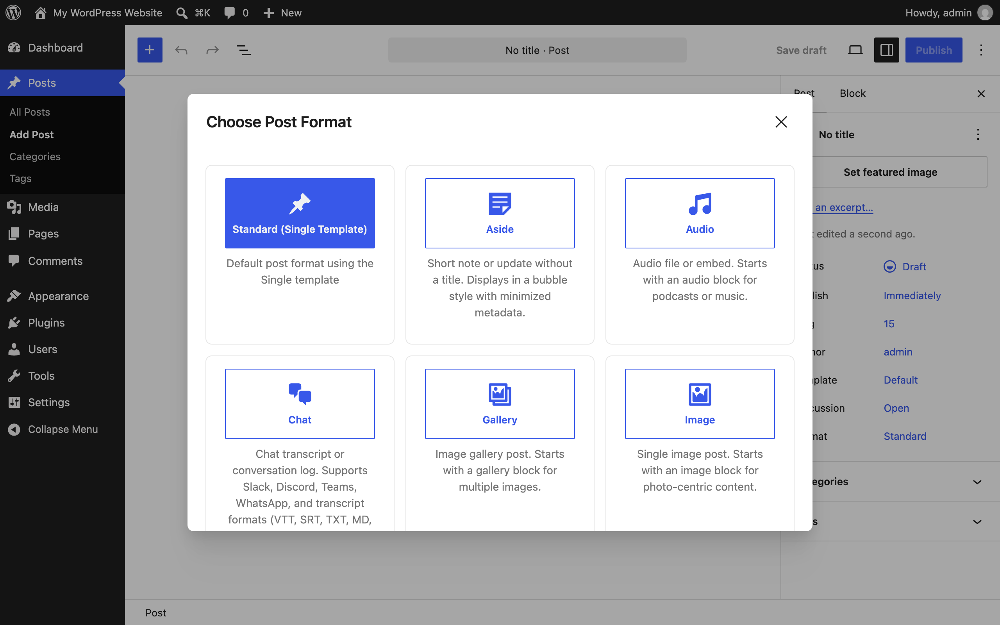
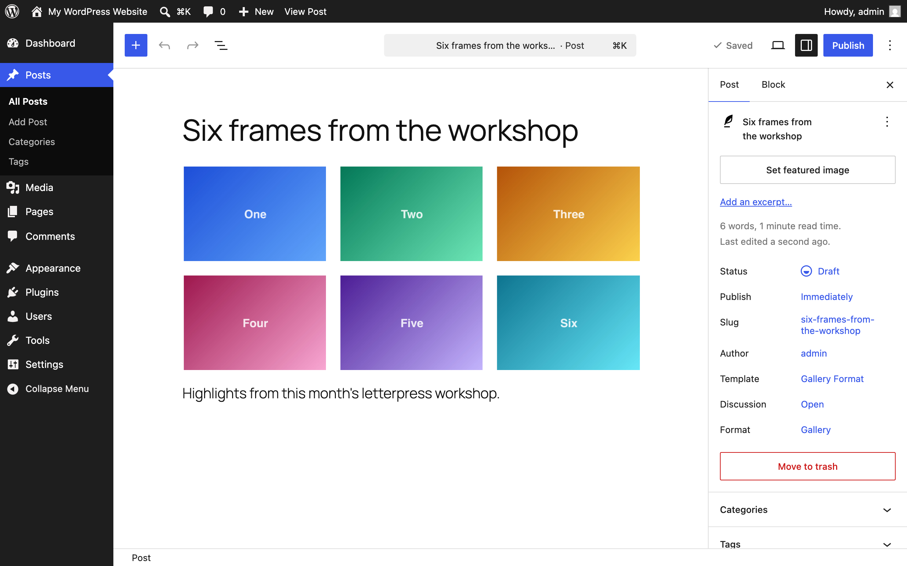
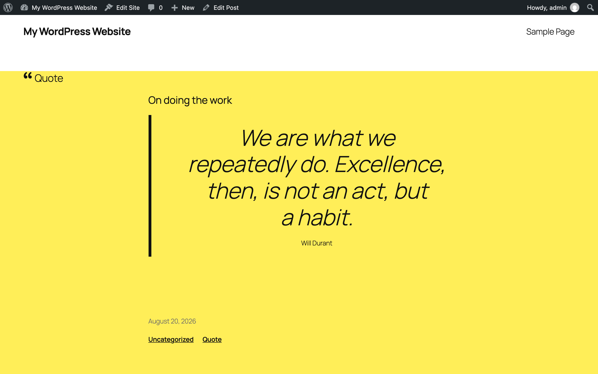

# Post Formats for Block Themes

[](https://wordpress.org/plugins/post-formats-for-block-themes/)
[](https://www.php.net/)
[](https://www.gnu.org/licenses/gpl-2.0.html)
[](https://github.com/sponsors/courtneyr-dev)

A modern WordPress plugin that brings post format functionality to block themes with intelligent patterns, automatic detection, and an enhanced editor experience.

Includes an integrated Chat Log block for displaying conversation transcripts from Slack, Discord, Teams, WhatsApp, Telegram, Signal, and more. Supports SRT subtitles, VTT captions, .docx documents, and .html files. No separate plugin needed.

---

## User documentation

**User documentation:** [Read the complete Post Formats for Block Themes documentation](https://courtneyr-dev.github.io/post-formats-for-block-themes/)

Key pages:

- [Installation](https://courtneyr-dev.github.io/post-formats-for-block-themes/installation/)
- [Getting started](https://courtneyr-dev.github.io/post-formats-for-block-themes/getting-started/)
- [Settings](https://courtneyr-dev.github.io/post-formats-for-block-themes/settings/)
- [Common tasks](https://courtneyr-dev.github.io/post-formats-for-block-themes/common-tasks/)
- [Troubleshooting](https://courtneyr-dev.github.io/post-formats-for-block-themes/troubleshooting/)
- [For theme developers](https://courtneyr-dev.github.io/post-formats-for-block-themes/theme-integration/) — tokens, hooks, and the styling contract

The docs site builds from [`docs/`](docs/) with Astro Starlight — see [docs/MAINTAINING.md](docs/MAINTAINING.md) to update it.

---

## Download

### From WordPress.org (Recommended)

Install directly from the [WordPress.org Plugin Directory](https://wordpress.org/plugins/post-formats-for-block-themes/).

1. Go to **Plugins > Add New** in your WordPress admin
2. Search for **"Post Formats for Block Themes"**
3. Click **Install Now** and then **Activate**

### From GitHub Releases

Download the latest release: [Releases](https://github.com/courtneyr-dev/post-formats-for-block-themes/releases)

---

## Features

### Core Functionality

- **10 Format-Specific Block Patterns** with locked first blocks for consistency
- **Integrated Chat Log Block** for conversation transcripts (chatlog/conversation block)
  - Platforms: Slack, Discord, Microsoft Teams, WhatsApp, Telegram, Signal
  - File formats: SRT subtitles, VTT captions, .docx documents, .html files
- **Automatic Format Detection** based on content structure
- **Format Selection Modal** on new post creation with visual format cards
- **Format Switcher Panel** for mid-edit format changes with content preservation
- **Status Format Validation** with Twitter-style 280-character limit and real-time counter
- **Post Format Repair Tool** to scan and fix format mismatches across all posts
- **Block Theme Integration** with CSS custom properties from theme.json

### Plugin Integrations

- **[Bookmark Card](https://wordpress.org/plugins/bookmark-card/)** - Enhanced link previews for Link format
- **[Podlove Podcasting Plugin](https://wordpress.org/plugins/podlove-podcasting-plugin-for-wordpress/)** - Advanced podcast features for Audio format
- **[Able Player](https://wordpress.org/plugins/ableplayer/)** - Accessible media player for Video and Audio formats
- **[RSS Chat](https://github.com/pfefferle/wordpress-rss-chat)** - Reads the Chat format the other way round: it syndicates chat-format posts to the rss.chat network. Nothing here integrates with it, but the two meet on that format, so a post formatted as Chat is also sent once RSS Chat is connected. See [issue #6](https://github.com/pfefferle/wordpress-rss-chat/issues/6). GitHub only.

All integrations are optional with graceful fallbacks to WordPress core blocks.

---

## Requirements

- **WordPress:** 6.9 or higher
- **PHP:** 7.4 or higher (8.0+ recommended)
- **Theme:** Block theme with Full Site Editing (classic themes not supported)
- **Browser:** Modern browser with JavaScript enabled

### Recommended Block Themes

- Twenty Twenty-Five (WordPress 2025 default)
- Twenty Twenty-Four (WordPress 2024 default)
- Twenty Twenty-Three (WordPress 2023 default)
- Any modern block theme from [WordPress.org Theme Directory](https://wordpress.org/themes/)

---

## Installation

### Manual Installation

1. Download the latest release ZIP from [GitHub Releases](https://github.com/courtneyr-dev/post-formats-for-block-themes/releases)
2. Go to **Plugins > Add New > Upload Plugin**
3. Choose the ZIP file and click **Install Now**
4. Click **Activate Plugin**

### Development Installation

```bash
# Clone the repository
git clone https://github.com/courtneyr-dev/post-formats-for-block-themes.git
cd post-formats-for-block-themes

# Install Node dependencies
npm install

# Install Composer dependencies (optional, for development tools)
composer install

# Build JavaScript assets
npm run build

# Copy to WordPress plugins directory
# Example for Local by Flywheel:
cp -r . ~/Local\ Sites/your-site/app/public/wp-content/plugins/post-formats-for-block-themes/

# Activate via WordPress admin or WP-CLI
wp plugin activate post-formats-for-block-themes
```

---

## Development

### Prerequisites

- **Node.js** 18+ (LTS recommended)
- **npm** or **yarn**
- **Composer** (for PHP development tools)
- **WordPress** 6.9+ local development environment

### Quick Start

```bash
# Install all dependencies
npm install
composer install

# Start development with hot reload
npm start

# Build for production
npm run build

# Run linting
npm run lint:js    # ESLint for JavaScript
npm run lint:css   # Stylelint for CSS
composer phpcs     # PHP_CodeSniffer for PHP
composer phpstan   # PHPStan static analysis
```

### Testing

```bash
# Run all tests
npm run test:all

# Individual test suites
npm run test:a11y         # Accessibility tests (Playwright + axe-core)
npm run test:e2e          # End-to-end tests (Playwright)
npm run test:visual       # Visual regression tests
npm run test:performance  # Performance benchmarks

# PHP tests
composer test             # Run all PHP tests
composer phpunit          # Unit tests only
```

### Project Structure

```
post-formats-for-block-themes/
├── .github/
│   ├── ISSUE_TEMPLATE/   # Bug report and feature request templates
│   ├── workflows/        # CI/CD pipelines
│   └── PULL_REQUEST_TEMPLATE.md
├── bin/                  # Helper scripts
│   ├── prepare-release.sh
│   └── detect-local-url.sh
├── blocks/
│   ├── chatlog/          # Integrated Chat Log block
│   └── format-badge/     # Format Badge block (Block Hooks)
├── build/                # Compiled JavaScript (generated)
├── docs/                 # Documentation
│   ├── TESTING-SUMMARY.md
│   ├── DEPLOYMENT.md
│   └── SETUP-COMPLETE.md
├── includes/             # PHP classes
│   ├── class-format-registry.php
│   ├── class-format-detector.php
│   ├── class-pattern-manager.php
│   ├── class-block-locker.php
│   ├── class-block-bindings-formats.php
│   ├── class-pfbt-feature-flags.php
│   ├── class-pfbt-abilities-manager.php
│   └── class-repair-tool.php
├── patterns/             # Block pattern PHP files
├── src/
│   └── editor/           # JavaScript source files
│       ├── format-modal/
│       └── format-switcher/
├── styles/               # CSS files
├── templates/            # Admin page templates
├── tests/                # Test suites
│   ├── accessibility/
│   ├── e2e/
│   ├── integration/
│   ├── unit/
│   ├── visual/
│   └── performance/
├── post-formats-for-block-themes.php  # Main plugin file
├── package.json
├── composer.json
└── readme.txt            # WordPress.org readme
```

---

## Screenshots







More screens — the Chat Log block, the Status counter, the Repair Tool, and the admin pages — are in the [screenshot gallery](https://courtneyr-dev.github.io/post-formats-for-block-themes/screenshots/).

---

## Usage

### For Users

1. **Create a New Post** - Format selection modal appears automatically
2. **Choose Your Format** - Select from 10 format options with descriptions
3. **Start Writing** - Pattern is inserted with locked first block for consistency
4. **Change Formats** - Use the Format Switcher in the sidebar at any time
5. **Fix Old Posts** - Run **Tools > Post Format Repair** to scan existing posts

### For Developers

#### Register Custom Format

```php
add_filter( 'pfbt_registered_formats', function( $formats ) {
    $formats['review'] = [
        'name'         => __( 'Review', 'my-theme' ),
        'description'  => __( 'Product or service review', 'my-theme' ),
        'icon'         => 'star-filled',
        'pattern_slug' => 'my-theme/review-pattern',
    ];
    return $formats;
} );
```

#### Custom Detection Logic

```php
add_filter( 'pfbt_detected_format', function( $format, $first_block, $all_blocks ) {
    // Detect custom block as Gallery format
    if ( $first_block['blockName'] === 'my-plugin/custom-gallery' ) {
        return 'gallery';
    }

    // Use default detection
    return $format;
}, 10, 3 );
```

#### Modify Pattern Content

```php
add_filter( 'pfbt_pattern_content', function( $content, $format_slug ) {
    // Add custom block to Quote patterns
    if ( $format_slug === 'quote' ) {
        $content .= '<!-- wp:paragraph {"className":"quote-source"} -->';
        $content .= '<p class="quote-source">Source information</p>';
        $content .= '<!-- /wp:paragraph -->';
    }
    return $content;
}, 10, 2 );
```

#### React to Format Detection

```php
add_action( 'pfbt_format_detected', function( $post_id, $format, $post ) {
    // Log format detection
    error_log( sprintf( 'Post %d detected as %s format', $post_id, $format ) );

    // Send notification for video posts
    if ( $format === 'video' ) {
        wp_mail(
            'editor@example.com',
            'New Video Post Published',
            sprintf( 'A new video post was published: %s', get_permalink( $post_id ) )
        );
    }
}, 10, 3 );
```

#### Track Format Changes

```php
add_action( 'pfbt_format_changed', function( $post_id, $old_format, $new_format ) {
    // Update custom meta when format changes
    update_post_meta( $post_id, '_format_changed_at', current_time( 'timestamp' ) );
    update_post_meta( $post_id, '_previous_format', $old_format );

    // Analytics tracking
    do_action( 'track_event', 'format_switched', [
        'post_id'    => $post_id,
        'from'       => $old_format,
        'to'         => $new_format,
    ] );
}, 10, 3 );
```

#### Post-Repair Actions

```php
add_action( 'pfbt_format_repaired', function( $post_id, $format ) {
    // Clear caches after format repair
    clean_post_cache( $post_id );

    // Update repair log
    $repairs = get_option( 'pfbt_repair_log', [] );
    $repairs[] = [
        'post_id'   => $post_id,
        'format'    => $format,
        'timestamp' => current_time( 'timestamp' ),
    ];
    update_option( 'pfbt_repair_log', $repairs );
}, 10, 2 );
```

### Hooks Reference

#### Filters

| Filter                           | Description                                   | Parameters                               |
| -------------------------------- | --------------------------------------------- | ---------------------------------------- |
| `pfbt_registered_formats`        | Modify or add format definitions              | `$formats`                               |
| `pfbt_detected_format`           | Filter auto-detected format before assignment | `$format`, `$first_block`, `$all_blocks` |
| `pfbt_pattern_content`           | Modify pattern HTML before insertion          | `$content`, `$format_slug`               |
| `pfbt_format_signal_weights`     | Adjust signal weights for format detection    | `$weights`                               |
| `pfbt_format_signals`            | Filter format detection signals               | `$signals`, `$post_id`                   |
| `pfbt_format_mf2_map`            | Modify microformats2 class mapping            | `$map`                                   |
| `pfbt_mf2_markup`                | Filter generated mf2 markup                   | `$markup`, `$post_id`                    |
| `pfbt_feature_{$flag}`           | Override individual feature flags             | `$enabled`                               |
| `pfbt_webmention_contexts`       | Filter webmention context mapping             | `$contexts`                              |
| `pfbt_webmention_display_config` | Filter webmention display configuration       | `$config`                                |
| `pfbt_posse_targets`             | Filter POSSE syndication targets              | `$targets`                               |
| `pfbt_format_char_limits`        | Modify character limits per format            | `$limits`                                |
| `pfbt_format_kind_map`           | Filter format-to-Post-Kind mapping            | `$map`                                   |
| `pfbt_kind_format_map`           | Filter Post-Kind-to-format mapping            | `$map`                                   |
| `pfbt_auto_suggest_kind`         | Filter auto-suggested Post Kind               | `$kind`, `$post_id`                      |
| `pfbt_auto_suggest_format`       | Filter auto-suggested format                  | `$format`, `$post_id`                    |

#### Actions

| Action                          | Description                                       | Parameters                               |
| ------------------------------- | ------------------------------------------------- | ---------------------------------------- |
| `pfbt_format_detected`          | Runs after automatic format detection             | `$post_id`, `$format`, `$post`           |
| `pfbt_format_changed`           | Runs when user changes format via switcher        | `$post_id`, `$old_format`, `$new_format` |
| `pfbt_format_repaired`          | Runs after repair tool fixes a format             | `$post_id`, `$format`                    |
| `pfbt_format_switched`          | Runs when format is switched                      | `$post_id`, `$format`                    |
| `pfbt_abilities_registered`     | Runs after Abilities API abilities are registered | -                                        |
| `pfbt_mcp_abilities_registered` | Runs after MCP abilities are registered           | -                                        |
| `pfbt_kind_auto_suggested`      | Runs after Post Kind auto-suggestion              | `$post_id`, `$kind`                      |
| `pfbt_format_auto_suggested`    | Runs after format auto-suggestion                 | `$post_id`, `$format`                    |

---

## Architecture

### Design Principles

- **Separation of Concerns** - Each PHP class handles one responsibility
- **WordPress Standards** - Follows WordPress Coding Standards and best practices
- **Extensibility** - Comprehensive hooks for customization without modifying core
- **Performance** - JavaScript only loads in editor, no frontend overhead
- **Graceful Degradation** - Plugin integrations work optionally with fallbacks

### Key Components

#### PHP Classes

- **`Format_Registry`** - Manages format definitions and metadata
- **`Format_Detector`** - Analyzes post content to determine format
- **`Pattern_Manager`** - Handles pattern registration and retrieval
- **`Block_Locker`** - Manages block locking for first blocks
- **`Repair_Tool`** - Admin interface for scanning and fixing formats
- **`Format_Styles`** - Enqueues theme-aware CSS
- **`Block_Bindings_Formats`** - Block Bindings source for format metadata
- **`Feature_Flags`** - Manages optional feature toggles
- **`Abilities_Manager`** - WordPress Abilities API integration

#### JavaScript Modules

- **`format-modal/`** - Modal UI for format selection on new posts
- **`format-switcher/`** - Sidebar panel for changing formats mid-edit
- **Status paragraph validation** - Real-time character counter for Status format

#### Block Patterns

Each format has a dedicated pattern file in `/patterns/`:

- `standard.php`, `aside.php`, `status.php`, `link.php`
- `gallery.php`, `image.php`, `quote.php`, `video.php`, `audio.php`, `chat.php`

Patterns use block locking to maintain format consistency while allowing content flexibility.

---

## Contributing

See [CONTRIBUTING.md](CONTRIBUTING.md) for development workflow, coding standards, and pull request guidelines.

---

## Security

See [SECURITY.md](SECURITY.md) for supported versions and how to report vulnerabilities.

---

## Support

See [SUPPORT.md](SUPPORT.md) for support channels and what to include in your report.

---

## License

This plugin is licensed under the **GPL v2 or later**.

```
Copyright (C) 2025 Courtney Robertson

This program is free software; you can redistribute it and/or modify
it under the terms of the GNU General Public License as published by
the Free Software Foundation; either version 2 of the License, or
(at your option) any later version.

This program is distributed in the hope that it will be useful,
but WITHOUT ANY WARRANTY; without even the implied warranty of
MERCHANTABILITY or FITNESS FOR A PARTICULAR PURPOSE. See the
GNU General Public License for more details.
```

Full license text: [GPL-2.0](https://www.gnu.org/licenses/gpl-2.0.html)

---

## Credits

- **Inspired by:** WordPress [Twenty Thirteen theme](https://wordpress.org/themes/twentythirteen/)'s post format treatments
- **Built with:** WordPress [Gutenberg components](https://developer.wordpress.org/block-editor/reference-guides/components/) and [Block Editor APIs](https://developer.wordpress.org/block-editor/)
- **Icons:** [Dashicons](https://developer.wordpress.org/resource/dashicons/)
- **Developed by:** [Courtney Robertson](https://github.com/courtneyr-dev)

### Special Thanks

- WordPress core team for the block editor
- Gutenberg contributors for accessible components
- WordPress.org plugin review team
- All contributors and testers

---

## Deployment

### Creating a Release

```bash
# Prepare release (runs tests, builds assets, updates versions)
./bin/prepare-release.sh 1.2.0

# Create GitHub release
gh release create v1.2.0 \
  --title "Version 1.2.0" \
  --notes "See CHANGELOG for details"

# Deployment to WordPress.org happens automatically via GitHub Actions
```

See [docs/DEPLOYMENT.md](docs/DEPLOYMENT.md) for complete deployment guide.

---

## Additional Documentation

- **[Testing Guide](docs/TESTING-SUMMARY.md)** - Comprehensive testing documentation
- **[Deployment Guide](docs/DEPLOYMENT.md)** - WordPress.org deployment process
- **[Setup Complete](docs/SETUP-COMPLETE.md)** - Infrastructure overview
- **[Changelog](CHANGELOG.md)** - Version history

---

## Links

- **WordPress.org**: https://wordpress.org/plugins/post-formats-for-block-themes/
- **GitHub Repository**: https://github.com/courtneyr-dev/post-formats-for-block-themes
- **Issue Tracker**: https://github.com/courtneyr-dev/post-formats-for-block-themes/issues
- **Sponsor**: https://github.com/sponsors/courtneyr-dev

---

<div align="center">

**Made for the WordPress block theme community**

[](https://github.com/courtneyr-dev/post-formats-for-block-themes/stargazers)
[](https://github.com/courtneyr-dev/post-formats-for-block-themes/network/members)

</div>
