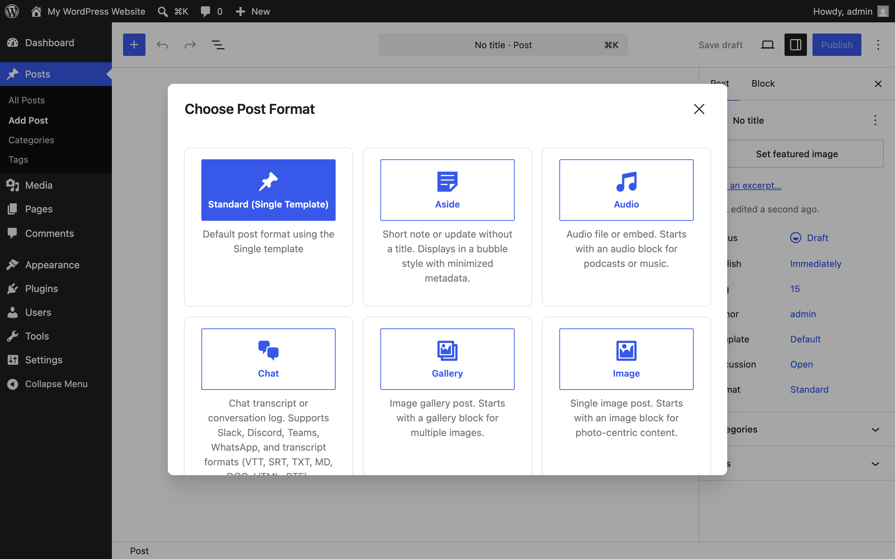
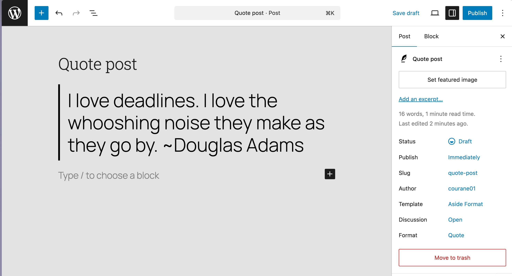

# Getting started

Create your first formatted post and learn the three ways a post gets its format: the modal, the Format Switcher, and auto-detection. These steps assume the plugin is active on a block theme — see [Installation](installation.md) if it isn't yet.

## What's a post format?

A post format is a label on a post — quote, video, status, chat, and so on — that lets your theme present that kind of content differently. The plugin registers nine formats (aside, gallery, link, image, quote, status, video, audio, chat) alongside WordPress's default "standard" format, so you see 10 choices in the editor. Formats your theme already declares are kept, not replaced.

## First task: publish a quote post

1. Go to **Posts → Add New**. The **Choose Post Format** modal appears with 10 format cards.

   

2. Choose **Quote**. Expected result: the quote pattern is inserted — a pullquote with an attribution field as a locked first block. The lock keeps the format's structure intact; you edit the text inside it.

   

3. Type the quotation and the attribution, add any extra content below the pattern, and click **Publish**. Expected result: the post displays with your theme's quote styling, and the post's Format shows "Quote" in the post sidebar.

## Change a format mid-edit: the Format Switcher

While editing any post, open the post sidebar and find the **Format Switcher** panel. It shows the current format and a dropdown to switch. When you switch, you choose whether to replace the content with the new format's pattern or keep what you've written. (Screenshot planned: see [screenshot inventory](screenshots.md).)

## Auto-detection: formats from content

The plugin analyzes the first block of a post when you save and can assign a matching format — for example, a pullquote suggests Quote, a gallery suggests Gallery. Two rules keep it predictable:

- **Apply once.** Detection assigns a format on the first save from content, then stops. Later edits don't flip the format back and forth.
- **Manual wins.** If you picked a format yourself (modal, switcher, or the core Format control), auto-detection never overrides it.

If you want a different format than the one detected, just change it in the Format Switcher — your choice sticks.

## First-run things that surprise people

- **The modal only appears on new posts.** Existing posts keep their current format; use the Format Switcher to change them.
- **Formats mostly inherit your theme's styling.** The plugin ships structural tokens, not a design; your theme's colors and typography apply. To restyle a format, use the Site Editor — see the [Site Editor guide](../SITE-EDITOR-GUIDE.md) and the [format customization quick start](../FORMAT-CUSTOMIZATION-QUICK-START.md).
- **The first block is locked on purpose.** It preserves the format's structure. Add more blocks after it.
- **Older versions (before 2.3.0) had known editor issues** — the modal could stack over the welcome guide, and Quote/Video patterns could show block validation errors. Update to the latest version if you see these; see [Troubleshooting](troubleshooting.md).

## Where to go next

- Try the **Chat Log block**: see [Common tasks](common-tasks.md) for publishing a chat transcript.
- Review [Settings](settings.md) for the icon set picker and the repair tool.

---

[Documentation home](index.md) · Previous: [Installation](installation.md) · Next: [Settings](settings.md)
