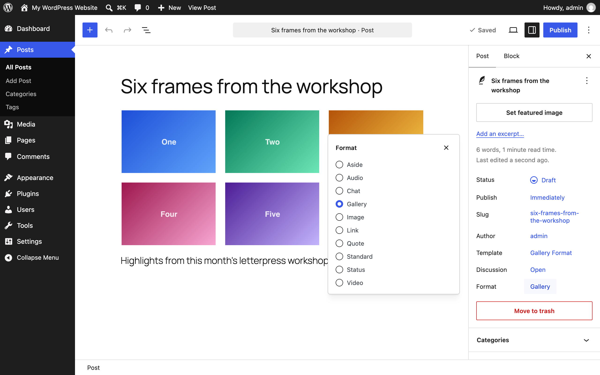
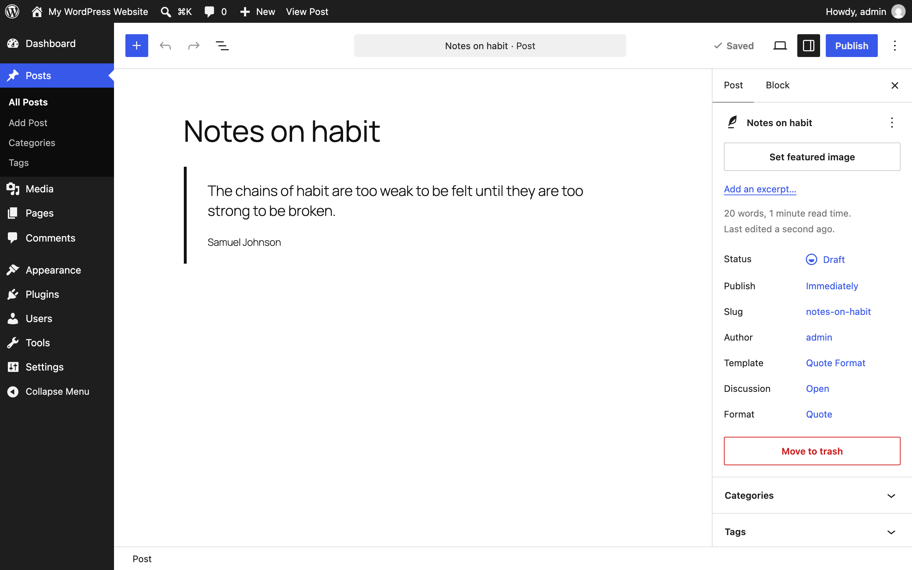
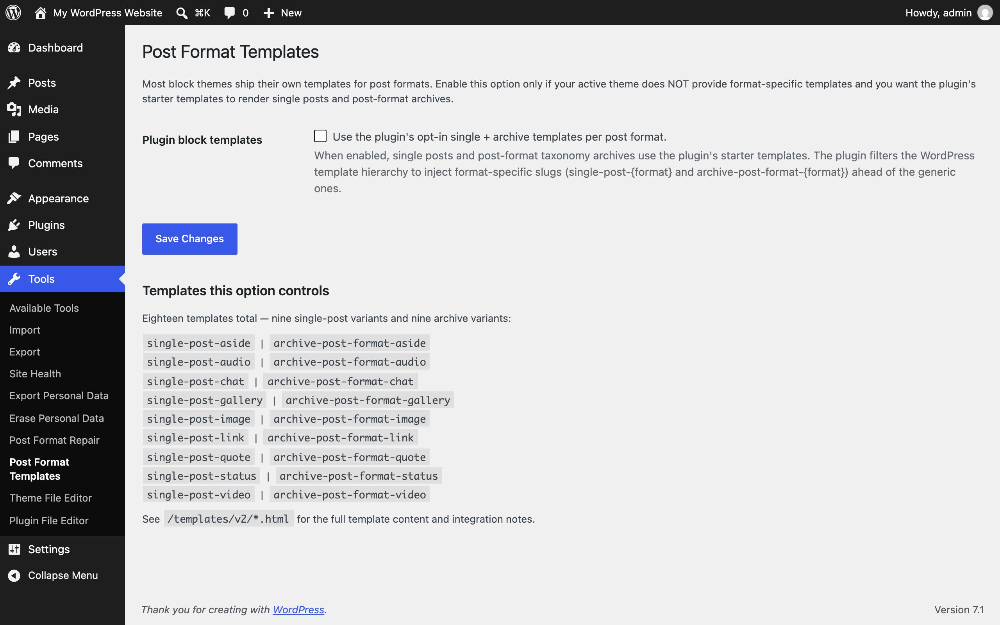

The screens Post Formats for Block Themes adds to WordPress. Every screenshot has a text equivalent in the page that documents the task, so you never need the image to follow the instructions.

Screenshots come from the repeatable capture script (`npm run screenshots:docs`, which runs against a disposable WordPress Playground with a block theme active) and from assets shipped in the repository.

## Editor

The format selection modal on a new post: pick one of the ten formats, each with an icon and description. See [Getting started](/post-formats-for-block-themes/getting-started/).

The **Chat Log** block after pasting a transcript — the platform is detected and display settings live in the sidebar. See [Common tasks](/post-formats-for-block-themes/common-tasks/).

A quote post: the locked pullquote pattern with attribution, and the format set in the sidebar. See [Common tasks](/post-formats-for-block-themes/common-tasks/).

A status post with the remaining-characters counter under the text field. See [Common tasks](/post-formats-for-block-themes/common-tasks/).

The gallery pattern keeps the first block structure intact.

Change a post's format without leaving the editor: the **Format** control in the Summary panel lists all ten formats. See [Common tasks](/post-formats-for-block-themes/common-tasks/).

Auto-detection applied the Quote format to this draft on its first save — it runs once, silently, and never overrides a choice you make yourself. See [Settings](/post-formats-for-block-themes/settings/).

## Front end

A published chat post rendered in the bubbles style with avatars, usernames, and timestamps.

The Format Badge labels each post's format for readers.

## Admin screens

**Settings → Post Formats**: choose the icon set used across badges and icons. See [Settings](/post-formats-for-block-themes/settings/).

**Tools → Post Format Repair**: scan for posts whose format doesn't match their content, then fix them in bulk. See [Settings](/post-formats-for-block-themes/settings/).

**Tools → Post Format Templates**: opt in to the plugin's 18 single and archive templates. See [Settings](/post-formats-for-block-themes/settings/).

All screens on this page are captured; there is no outstanding manual list. Two earlier
specifications described UI the plugin does not have — a custom Format Switcher panel with an
auto-detection status readout, and an auto-detection suggestion notice. The shots above show what
actually ships instead: core's Format control in the Summary panel is the mid-edit switcher, and
auto-detection applies a format silently on first save (apply-once, never overriding a manual
choice). If those custom UIs ever ship, add their shots to `scripts/capture-docs-screenshots.js`
so they regenerate with the rest.
