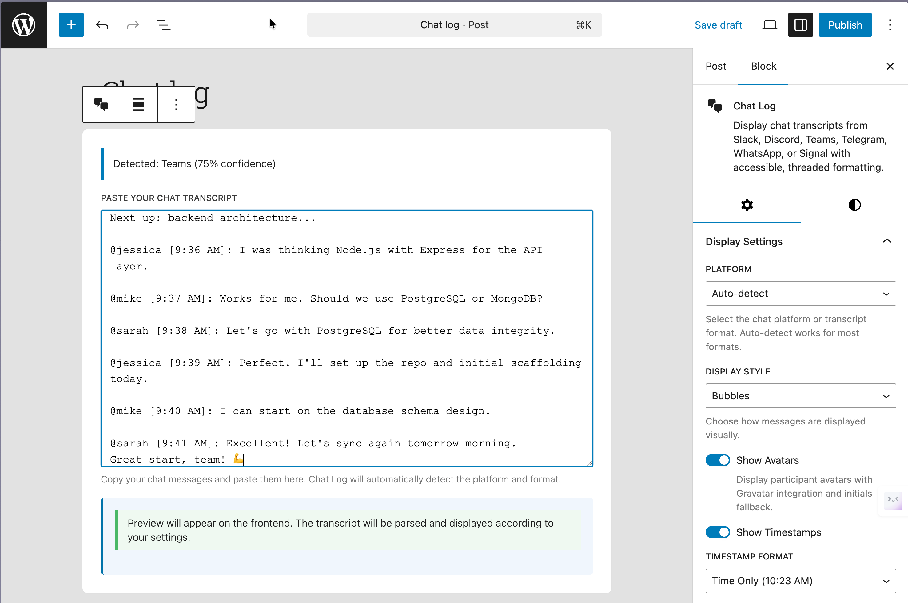
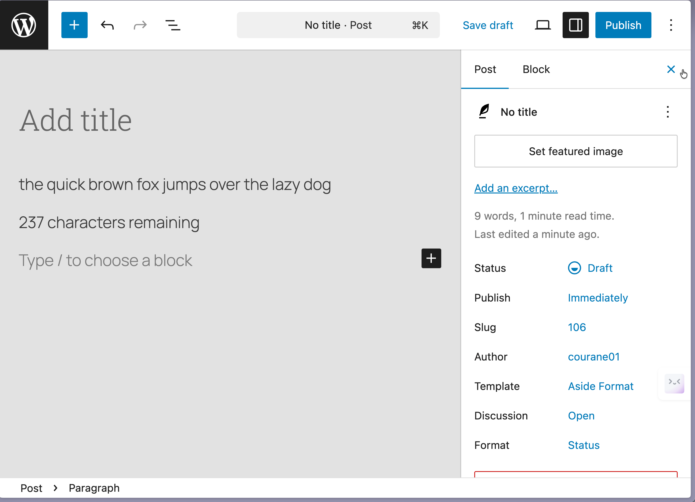
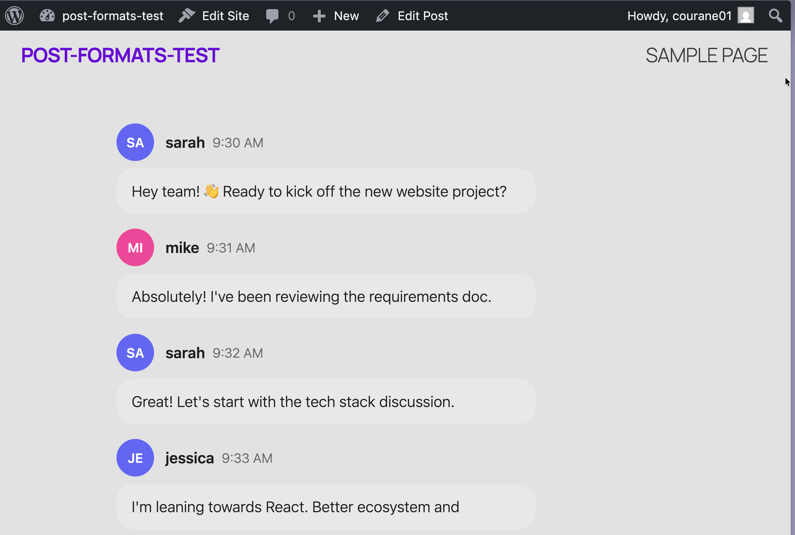
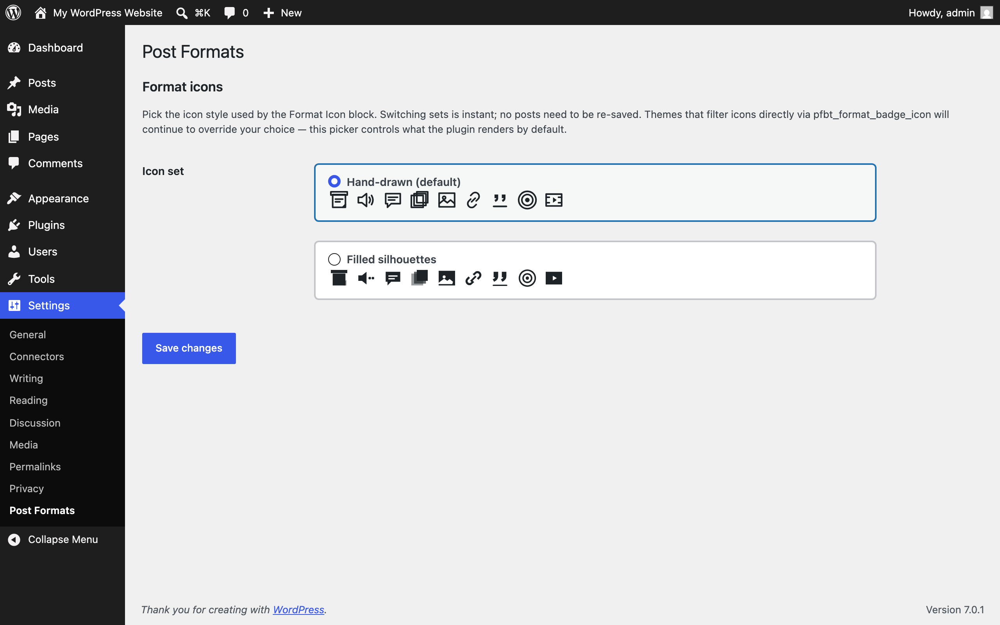
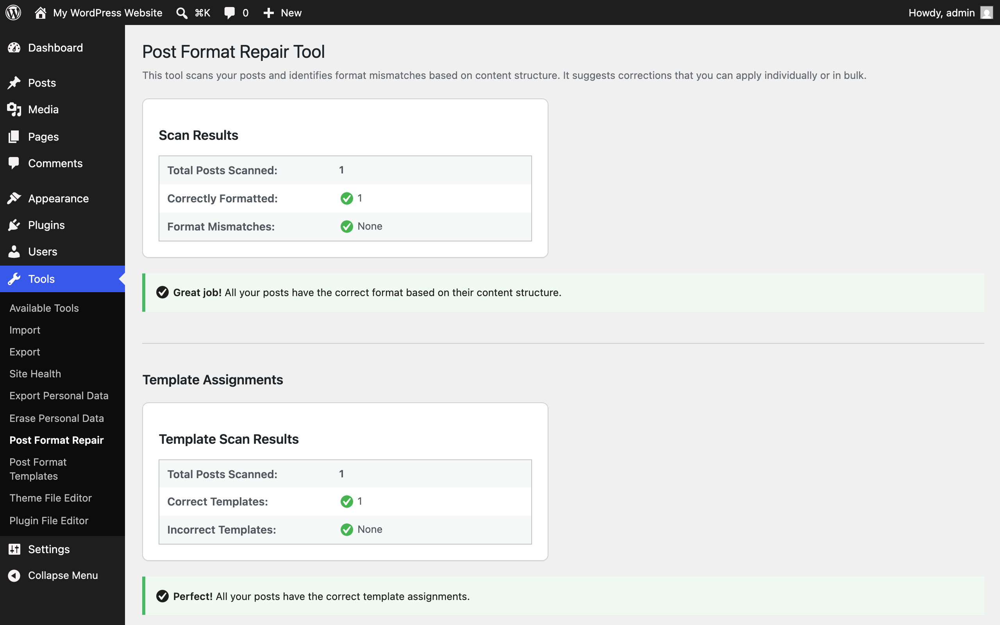

The screens Post Formats for Block Themes adds to WordPress. Every screenshot has a text equivalent in the page that documents the task, so you never need the image to follow the instructions.

Screenshots come from the repeatable capture script (`npm run screenshots:docs`, which runs against a disposable WordPress Playground with a block theme active) and from assets shipped in the repository. Manual captures still needed are specified at the end of this page.

## Editor

The format selection modal on a new post: pick one of the ten formats, each with an icon and description. See [Getting started](/post-formats-for-block-themes/getting-started/).

The **Chat Log** block after pasting a transcript — the platform is detected and display settings live in the sidebar. See [Common tasks](/post-formats-for-block-themes/common-tasks/).

A quote post: the locked pullquote pattern with attribution, and the format set in the sidebar. See [Common tasks](/post-formats-for-block-themes/common-tasks/).

A status post with the remaining-characters counter under the text field. See [Common tasks](/post-formats-for-block-themes/common-tasks/).

## Front end

A published chat post rendered in the bubbles style with avatars, usernames, and timestamps.

## Admin screens

**Settings → Post Formats**: choose the icon set used across badges and icons. See [Settings](/post-formats-for-block-themes/settings/).

**Tools → Post Format Repair**: scan for posts whose format doesn't match their content, then fix them in bulk. See [Settings](/post-formats-for-block-themes/settings/).

## Screenshots still needed

Each row is the full capture specification (block theme active, 1280×800 at 2x).

| Filename | Screen and state | What to highlight | Alt text | Caption |
| --- | --- | --- | --- | --- |
| editor-format-switcher.png | Editor sidebar with the Format Switcher panel open on an existing post | Current format + dropdown | Format Switcher sidebar panel showing the current format, auto-detection status, and a dropdown to switch formats | Change a post's format without leaving the editor. |
| editor-autodetect-notice.png | New post with a pullquote block inserted and saved | The suggestion notice | Editor notice suggesting the Quote format after a pullquote block is added | Auto-detection suggests a format once — your choice always wins. |
| editor-gallery-format.png | Gallery post with six or more images in the locked pattern | The responsive grid | Gallery format pattern in the editor with a locked gallery block in a responsive grid | The gallery pattern keeps the first block structure intact. |
| admin-block-templates.png | Tools → Post Format Templates with the opt-in visible | Checkbox + template list | Post Format Templates page with the opt-in checkbox and the list of single and archive templates | Opt in to the plugin's 18 single and archive templates. |
| frontend-format-badge.png | Published non-standard-format post | The badge before the title | Format badge displayed before a post title on the frontend | The Format Badge labels each post's format for readers. |
