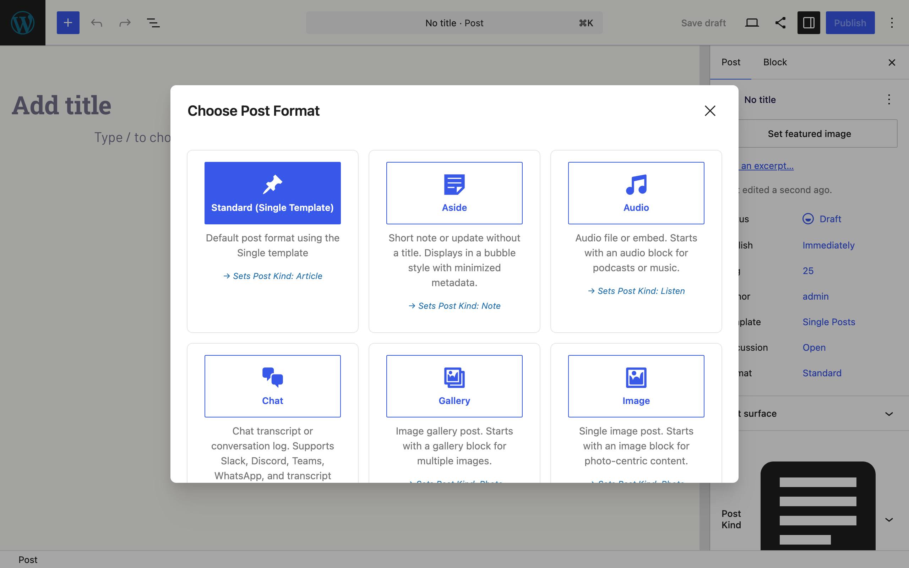
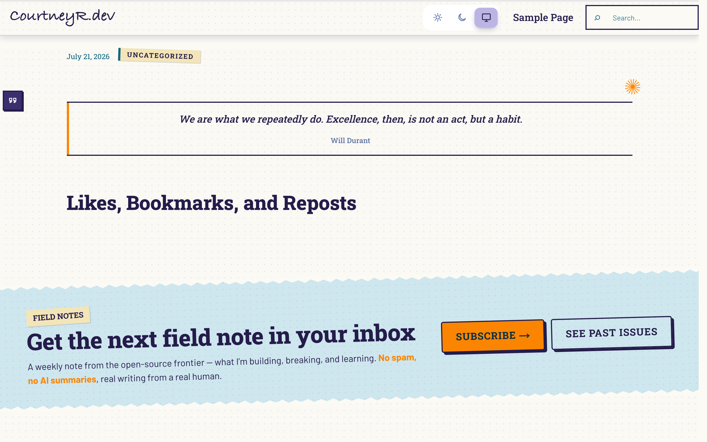

Post Formats for Block Themes is part of a small suite of IndieWeb plugins that detect each other and coordinate when they share a site: [Post Kinds for IndieWeb in Block Themes](https://courtneyr-dev.github.io/post-kinds-for-indieweb/), [Link Extension for XFN](https://courtneyr-dev.github.io/link-extension-for-xfn/), and the [Outpost composer](https://courtneyr-dev.github.io/outpost/). Each plugin works alone; none of them requires the others.

The screenshots on this page come from a demo site running the whole suite with a styled block theme, so they show what readers see on a real site rather than a default install.

## Formats map to post kinds

With Post Kinds for IndieWeb active, the format selection modal announces the mapping on every card — **Standard → Article**, **Aside → Note**, **Audio → Listen**, **Gallery/Image → Photo**, and so on. Choosing a format sets the matching kind, so the two taxonomies stay in step without extra clicks. The **Post Kind** panel stays available in the sidebar for kinds that have no format equivalent (check-ins, RSVPs, reads).

## Styled themes carry the format treatment

A quote post on a styled theme: the theme's own single-post treatment applies (this one suppresses the title for quote posts), and the Format Badge renders in the margin. Posts published from the Outpost composer get their format inferred the same way — a note posted from your phone arrives as an Aside without touching the editor.

## What each plugin adds

- **Post Formats for Block Themes** — this plugin: format patterns, detection, badges, and templates.
- **Post Kinds for IndieWeb** — card blocks (listen, watch, read, check-in…) and microformats; formats map onto kinds automatically.
- **Link Extension for XFN** — relationship attributes on links in any post, whatever its format.
- **Outpost** — a phone-friendly composer that publishes via Micropub; its posts flow through format inference like any other post.
